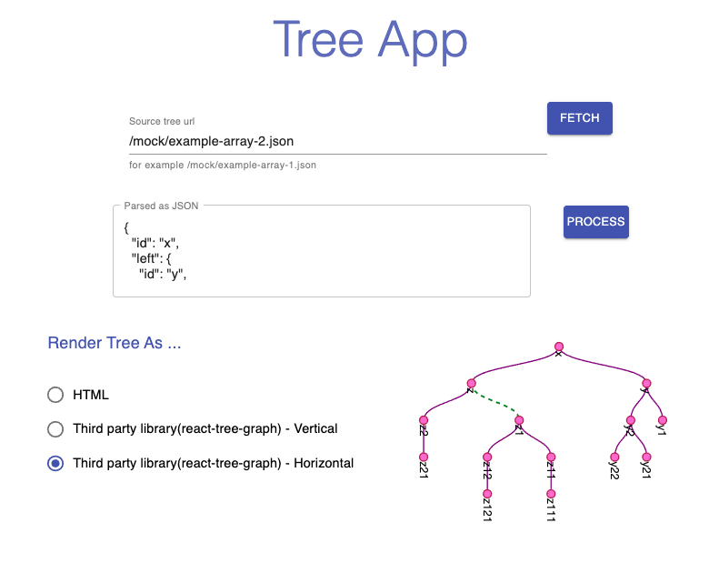
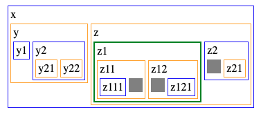
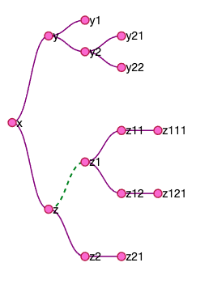

# Tree App.

- This app was created to resolve three differents problems.

- To use this app need to install all dependencies.

1- Unzip file if you download, then use npm o yarn to install depencies from node_modules.

if you use npm use this command to install depedencies.

```sh
    npm install /  npm i
```

if you use yarn use this command to install depedencies.

```sh
    yarn
```

- After that need to start the app, use the following comando to start app.

```sh
    npm start
```

```sh
    yarn start
```

The source tree you want to use 5 files, this files youn can find on public/mock/ or use whatever url to check this implementation.

---

# Problems and solutions.

## Problem #1

Implements a function that recives an array that represent a tree. The array have a predefined structure

- Id on index 0
- Left side of the binary tree, it could be an id or another array
- Right side of the binary tree, it could be an id or another array

The implemented function returns a `BinaryTree` as the root of the binary tree.

## Problem #2

The single page app was built

- with react
- I used the react hooks to manage the state
- the was broken on components

### FileLoader

That is in charge of request the file url and fetch the content.

### TextAreaTree

Is in charge of display the array information as a JSON representation.

### OutputTree

Allow the user to display the binary tree as a HTML or SVG.



## Problem #3

The implementation uses helpers to find the smallest subtree and represent it with a green color.

### OutputTree HTML



### OutputTree SVG


